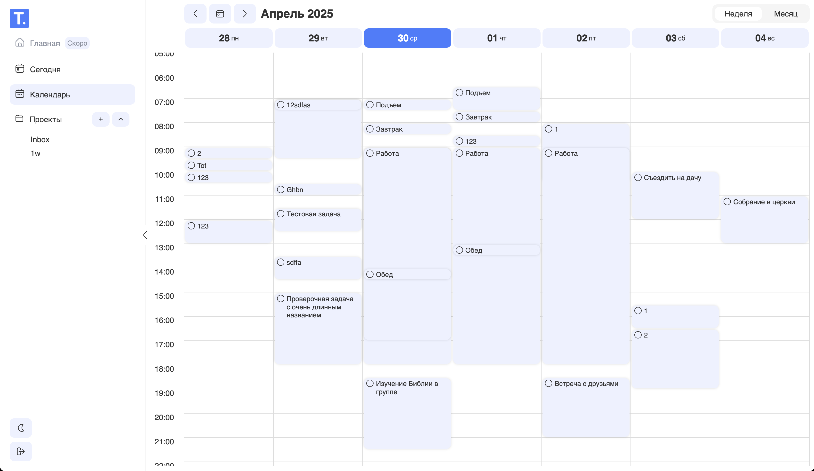

# TodoView

Расширенный интерфейс для Todoist

## Возможности

- Добавлять, редактировать, выполнять, удалять задачи
- Просматривать задачи в недельном виде
- Перемещать задачи на другой день недели и другое время
- Менять длительность задачи в календаре путем перемещения нижнего края карточки задачи
- Просматривать задачи на сегодня
- Просматривать задачи по проектам
- Добавлять, редактировать, удалять проекты
- Менять светлую/темную тему
- Синхронизировать данные с Todoist
- Переключать язык на русский или английский

## В разработке

- Главная страница со сводкой и статистикой
- Повторяющиеся задачи
- Подзадачи
- Приортиеты
- Фильтрация, сортировка, поиск
- Месячный и дневной вид календаря

## Первый запуск

1. Убедитесь что у вас установлен `pnpm` и необходимая версия `node`. Актуальную версию `node` вы можете посмотреть в файле `.nvmrc`
2. Запустите в корне `pnpm i` - это установит зависимости в node_modules
3. Создайте `.env` файл в корне проекта и заполните его по аналогии с `.env.example`
4. Запустите `pnpm dev` для запуска проекта в режиме разработки

## Скрипты для разработки

Рекомендуется использовать пакетный менеджер pnpm, ввиду его большей производительности. Но можно использовать и другие: npm, yarn и тп

- **`dev`**:  
  Запускает приложение в режиме разработки. Используется для локальной разработки с поддержкой горячей перезагрузки.  
  **Команда**: `pnpm dev`

- **`build`**:  
  Выполняет проверку типов и собирает проект для продакшена.  
  **Команда**: `pnpm build`

- **`preview`**:  
  Предоставляет возможность предпросмотра собранного приложения перед его деплоем.  
  **Команда**: `pnpm preview`

- **`lint`**:  
  Запускает линтер для проверки кода с использованием ESLint.  
  **Команда**: `pnpm lint`

- **`lint:fix`**:  
  Автоматически исправляет некоторые ошибки ESLint.  
  **Команда**: `pnpm lint:fix`

- **`lint:css`**:  
  Запускает линтер для проверки CSS-файлов с использованием Stylelint. Проверяет соответствие стилей установленным правилам.  
  **Команда**: `pnpm lint:css`

- **`lint:css:fix`**:  
  Автоматически исправляет ошибки форматирования в CSS-файлах с помощью Stylelint.  
  **Команда**: `pnpm lint:css:fix`

- **`test`**:
  Запускает все тесты один раз с помощью Vitest. Удобно для запуска тестов перед коммитом или деплоем.
  **Команда**: `pnpm test`

- **`test:watch`**:
  Запускает тесты в режиме наблюдения. При изменении файлов тесты автоматически перезапускаются. Полезно при разработке.
  **Команда**: `pnpm test:watch`

- **`test:coverage`**:
  Запускает тесты и отображает отчёт по покрытию кода. Используется для оценки полноты тестирования проекта.
  **Команда**: `pnpm test:coverage`

## Описание переменных окружения

- `VITE_TODOIST_CLIENT_ID`:  
  Идентификатор клиента в системе Todoist. Получается при регистрации приложения в Todoist Developer Console.

- `VITE_TODOIST_CLIENT_SECRET`:  
  Секрет клиента. Используется на серверной стороне для обмена кода авторизации на access token. Не должен попадать в публичный репозиторий.

- `VITE_TODOIST_REDIRECT_URI`:  
  URI, на который будет происходить редирект после авторизации пользователя в Todoist. Должен быть указан в настройках приложения в Todoist.
  **Пример**: `https://todoview.com/redirect-page`

- `VITE_TODOIST_STATE_STRING`:  
  Произвольная строка (чаще всего случайная), используемая для защиты от CSRF-атак при авторизации (state parameter).

- `VITE_LANG`:
  Язык приложения по умолчанию. Если не указан, используется 'ru'.
  **Пример**: `en`

## Описание архитектуры

В качестве архитектурной методологии используется FSD, подробнее - https://feature-sliced.github.io/documentation/

## Используемые зависимости

В проекте используются следующие зависимости:

- [React](https://react.dev/) для построения пользовательского интерфейса
- [TypeScript](https://www.typescriptlang.org/) для проверки типов
- [Zustand](https://zustand.docs.pmnd.rs/) для управления состоянием в React
- [Tanstack Query](https://tanstack.com/query) для работы с сервером
- [Todoist API TS](https://doist.github.io/todoist-api-typescript/) для удобной и типизированой работы с API Todoist
- [I18N](https://www.i18next.com/) для локализации проекта
- [DNDKit](https://dndkit.com/) для реализации drag-and-drop функциональности
- [Dayjs](https://day.js.org/) для работы с датами и временем (лёгкая альтернатива Moment.js)
- [React Router](https://reactrouter.com/) для маршрутизации на стороне клиента
- [Flaticon Uicons](https://www.npmjs.com/package/@flaticon/flaticon-uicons) для использования иконок из библиотеки Flaticon UIcons
- [Vite](https://vite.dev/) для сборки приложения

## Зависимости для разработки

Эти пакеты не влияют на работу самого приложения, но позволяют писать код быстрее и качественнее

- [Vitest](https://vitest.dev/) для тестирования TypeScript кода
- [Testing Library](https://testing-library.com/) для тестирования компонентов React
- [ESLint](https://eslint.org/) для улучшения качества TS кода
- [Stylelint](https://stylelint.io/) для улучшения качества CSS кода
- [Husky](https://typicode.github.io/husky/) для проверки тестов, линтеров перед комитом
