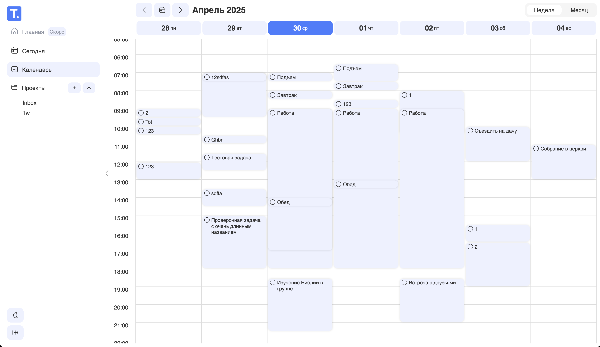

# TodoView

## Описание проекта

Расширенный интерфейс для Todoist

### Ключевые возможности

- Добавлять, редактировать, выполнять, удалять задачи
- Просматривать задачи в недельном виде
- Перемещать задачи на другой день недели и другое время
- Менять длительность задачи в календаре путем перемещения нижнего края карточки задачи
- Просматривать задачи на сегодня
- Просматривать задачи по проектам
- Добавлять, редактировать, удалять проекты
- Менять светлую/темную тему
- Синхронизировать данные с Todoist
- Переключать язык на русский или английский

### Функции в разработке

- Главная страница со сводкой и статистикой
- Повторяющиеся задачи
- Подзадачи
- Приортиеты
- Фильтрация, сортировка, поиск
- Месячный и дневной вид календаря

## Разработка проекта

### Первый запуск

1. Убедитесь что у вас установлен `pnpm` и необходимая версия `node`. Актуальную версию `node` вы можете посмотреть в файле `.nvmrc`
2. Запустите в корне `pnpm i` - это установит зависимости в node_modules
3. Создайте `.env` файл в корне проекта и заполните его по аналогии с `.env.example`
4. Запустите `pnpm dev` для запуска проекта в режиме разработки

### Описание переменных окружения

- `VITE_TODOIST_CLIENT_ID`:  
  Идентификатор клиента в системе Todoist. Получается при регистрации приложения в Todoist Developer Console.

- `VITE_TODOIST_CLIENT_SECRET`:  
  Секрет клиента. Используется на серверной стороне для обмена кода авторизации на access token. Не должен попадать в публичный репозиторий.

- `VITE_TODOIST_REDIRECT_URI`:  
  URI, на который будет происходить редирект после авторизации пользователя в Todoist. Должен быть указан в настройках приложения в Todoist.
  **Пример**: `https://todoview.com/redirect-page`

- `VITE_TODOIST_STATE_STRING`:  
  Произвольная строка (чаще всего случайная), используемая для защиты от CSRF-атак при авторизации (state parameter).

- `VITE_LANG`:
  Язык приложения по умолчанию. Если не указан, используется 'ru'.
  **Пример**: `en`

- `CHROMATIC_TOKEN`:
  Токен chromatic для запсука скриншотных тестов. Используется в скрипте `pnpm chromatic`

### Скрипты для разработки

Рекомендуется использовать пакетный менеджер pnpm, ввиду его большей производительности. Но можно использовать и другие: npm, yarn и тп

- **`dev`**:  
  Запускает приложение в режиме разработки. Используется для локальной разработки с поддержкой горячей перезагрузки.  
  **Команда**: `pnpm dev`

- **`build`**:  
  Выполняет проверку типов и собирает проект для продакшена.  
  **Команда**: `pnpm build`

- **`preview`**:  
  Предоставляет возможность предпросмотра собранного приложения перед его деплоем.  
  **Команда**: `pnpm preview`

- **`lint`**:  
  Запускает линтер для проверки кода с использованием ESLint.  
  **Команда**: `pnpm lint`

- **`lint:fix`**:  
  Автоматически исправляет некоторые ошибки ESLint.  
  **Команда**: `pnpm lint:fix`

- **`lint:css`**:  
  Запускает линтер для проверки CSS-файлов с использованием Stylelint. Проверяет соответствие стилей установленным правилам.  
  **Команда**: `pnpm lint:css`

- **`lint:css:fix`**:  
  Автоматически исправляет ошибки форматирования в CSS-файлах с помощью Stylelint.  
  **Команда**: `pnpm lint:css:fix`

- **`test`**:
  Запускает все тесты один раз с помощью Vitest. Удобно для запуска тестов перед коммитом или деплоем.
  **Команда**: `pnpm test`

- **`test:watch`**:
  Запускает тесты в режиме наблюдения. При изменении файлов тесты автоматически перезапускаются. Полезно при разработке.
  **Команда**: `pnpm test:watch`

- **`storybook`**:
  Запускает Storybook в режиме разработки. Позволяет просматривать и взаимодействовать с компонентами в изолированной среде.
  **Команда**: `pnpm storybook`

- **`storybook:build`**:
  Собирает статическую версию Storybook для деплоя. Создает оптимизированную версию документации компонентов.
  **Команда**: `pnpm storybook:build`

- **`chromatic`**:
  Запускает визуальное тестирование компонентов с помощью Chromatic. Создает скриншоты компонентов и сравнивает их с предыдущими версиями для выявления визуальных регрессий.
  **Команда**: `pnpm chromatic`

## Техническое описание проекта

### Основные папки

- **`src/`**: Основной каталог с исходным кодом приложения

  - Содержит все компоненты, утилиты, страницы и бизнес-логику приложения
  - Структурирован согласно методологии FSD ([Feature-Sliced Design](https://feature-sliced.github.io/documentation/))

- **`public/`**: Статические файлы, которые не требуют обработки сборщиком

  - Содержит фавиконки, манифест, локализации и другие статические ресурсы
  - Файлы из этой директории доступны по корневому пути в собранном приложении

- **`dist/`**: Собранное приложение (не отслеживается Git)

  - Создается при выполнении команды `pnpm build`

- **`node_modules/`**: Установленные зависимости (не отслеживается Git)

  - Автоматически создается при установке зависимостей через pnpm

- **`.github/`**: Конфигурация GitHub

  - `workflows/`: Настройки GitHub Actions для непрерывной интеграции, тестирования и деплоя
  - `assests/`: Скриншоты для README.md

- **`.storybook/`**: Конфигурация и статическая версия Storybook

  - Конфигурация Storybook, интеграция с Vitest и настройка предпросмотра компонентов, включая декораторы и глобальные параметры

- **`.husky/`**: Конфигурация Git-хуков

  - `pre-commit`: Запускает линтеры и тесты перед каждым коммитом
  - `commit-msg`: Проверяет сообщения коммитов на соответствие правилам

- **`scripts/`**: Вспомогательные скрипты для проекта

  - `check-commit-msg.js`: Скрипт для проверки сообщений коммитов

### Конфигурационные файлы

- **`package.json`**: Описание проекта и его зависимостей

  - Содержит скрипты, зависимости и метаданные проекта

- **`pnpm-lock.yaml`**: Фиксирует точные версии зависимостей

  - Обеспечивает воспроизводимые сборки на разных машинах

- **`tsconfig.json`**: Настройки TypeScript

  - Определяет правила компиляции TypeScript в JavaScript

- **`vite.config.ts`**: Конфигурация сборщика Vite

  - Настраивает процесс сборки, плагины и другие параметры Vite

- **`testing-library-config.ts`**: Конфигурация Testing Library

  - Настраивает окружение для тестирования компонентов React и интегрируется с Vitest

- **`.eslintrc.js`**: Конфигурация ESLint

  - Определяет правила проверки кода JavaScript/TypeScript

- **`.stylelintrc.json`**: Конфигурация Stylelint

  - Определяет правила проверки CSS-кода

- **`.gitignore`**: Список файлов и директорий, игнорируемых Git

  - Исключает из репозитория временные файлы, сборки и зависимости

- **`.env`**: Файл с переменными окружения (не отслеживается Git)

  - Содержит конфиденциальные данные и настройки для разных сред

- **`.env.example`**: Пример файла с переменными окружения

  - Шаблон для создания собственного `.env` файла

- **`commitlint.config.js`**: Конфигурация для проверки сообщений коммитов

  - Определяет правила форматирования сообщений коммитов

- **`stats.html`**: Визуализация бандла приложения

  - Генерируется плагином rollup-plugin-visualizer и показывает структуру и размер бандла для оптимизации

- **`README.md`**: Документация проекта
  - Содержит информацию о проекте, инструкции по установке и использованию

### Используемые зависимости

В проекте используются следующие зависимости:

- [React](https://react.dev/) для построения пользовательского интерфейса
- [TypeScript](https://www.typescriptlang.org/) для проверки типов
- [Zustand](https://zustand.docs.pmnd.rs/) для управления состоянием в React
- [Tanstack Query](https://tanstack.com/query) для работы с сервером
- [Todoist API TS](https://doist.github.io/todoist-api-typescript/) для удобной и типизированой работы с API Todoist
- [I18N](https://www.i18next.com/) для локализации проекта
- [DNDKit](https://dndkit.com/) для реализации drag-and-drop функциональности
- [Dayjs](https://day.js.org/) для работы с датами и временем (лёгкая альтернатива Moment.js)
- [React Router](https://reactrouter.com/) для маршрутизации на стороне клиента
- [Flaticon Uicons](https://www.npmjs.com/package/@flaticon/flaticon-uicons) для использования иконок из библиотеки Flaticon UIcons

### Зависимости для разработки

Эти пакеты не влияют на работу самого приложения, но позволяют писать код быстрее и качественнее

- [Vite](https://vite.dev/) для сборки приложения
- [Vitest](https://vitest.dev/) для тестирования TypeScript кода
- [Testing Library](https://testing-library.com/) для тестирования компонентов React
- [Storybook](https://storybook.js.org/) для разработки и тестирования UI компонентов в изолированной среде
- [Chromatic](https://www.chromatic.com/) для визуального тестирования
- [ESLint](https://eslint.org/) для улучшения качества TS кода
- [Stylelint](https://stylelint.io/) для улучшения качества CSS кода
- [Rollup Plugin Visualizer]() для визуализации бандла приложения
- [Husky](https://typicode.github.io/husky/) для проверки тестов, линтеров перед комитом
